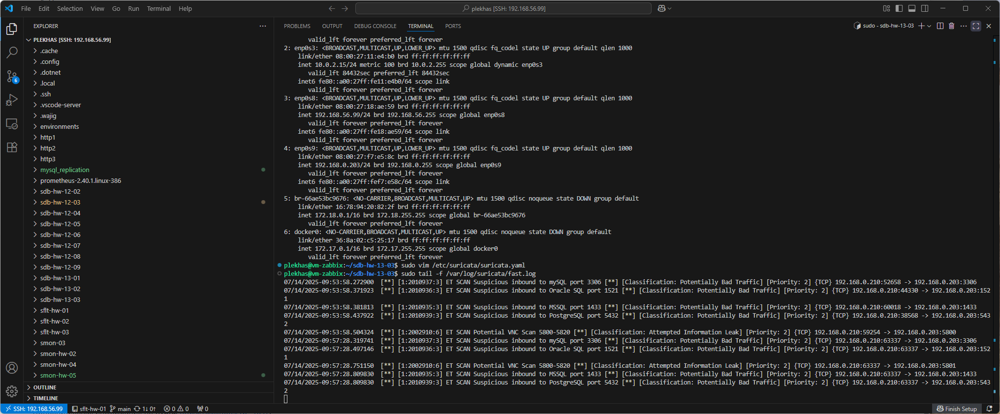
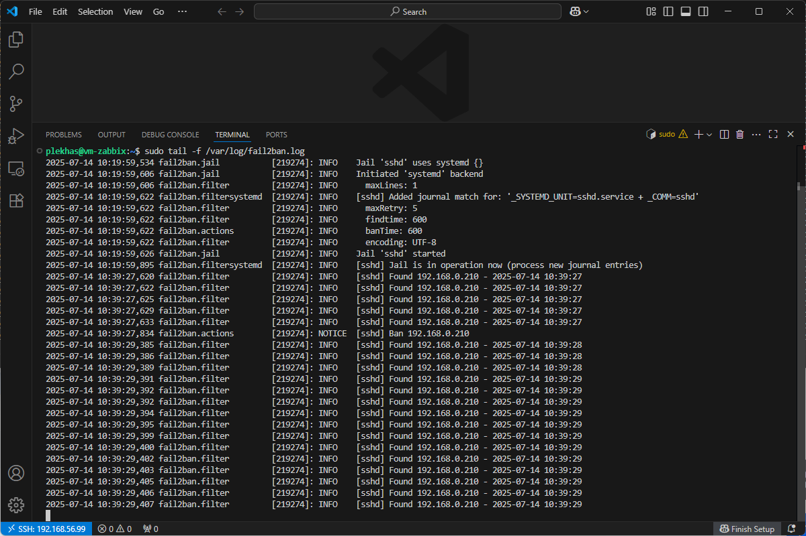

# Домашнее задание к занятию «Защита сети» - Плеханов С.А.

### Задание 1

Проведите разведку системы и определите, какие сетевые службы запущены на защищаемой системе:

**sudo nmap -sA < ip-адрес >**

**sudo nmap -sT < ip-адрес >**

**sudo nmap -sS < ip-адрес >**

**sudo nmap -sV < ip-адрес >**

По желанию можете поэкспериментировать с опциями: https://nmap.org/man/ru/man-briefoptions.html.


*В качестве ответа пришлите события, которые попали в логи Suricata и Fail2Ban, прокомментируйте результат.*

------
### Решение 1

При выполнении команды:
````sh
sudo nmap -sA 192.168.0.203
````
никаких уязвимостей обнаружено не было и в лог suricata так же ничего не попало.

При выполнении команды:
````sh
sudo nmap -sT 192.168.0.203
````
были обнаружены следующие открытые порты:


и в лог suricata попала следующая информация 


в которой видна активность сканирования с адреса 192.168.0.210


При выполнении команды:
````sh
sudo nmap -sS 192.168.0.203
````
были обнаружены следующие открытые порты:


и в лог suricata попала следующая информация



в которой видна активность сканирования с адреса 192.168.0.210


При выполнении команды:
````sh
sudo nmap -sV 192.168.0.203
````
были обнаружены следующие открытые порты:


и в лог suricata попала следующая информация


в которой видна активность сканирования с адреса 192.168.0.210

при этом сканирование сервисов длилось гораздо дольше и в лог попало больше иннформации.

### Задание 2

Проведите атаку на подбор пароля для службы SSH:

**hydra -L users.txt -P pass.txt < ip-адрес > ssh**

1. Настройка **hydra**: 
 
 - создайте два файла: **users.txt** и **pass.txt**;
 - в каждой строчке первого файла должны быть имена пользователей, второго — пароли. В нашем случае это могут быть случайные строки, но ради эксперимента можете добавить имя и пароль существующего пользователя.

Дополнительная информация по **hydra**: https://kali.tools/?p=1847.

2. Включение защиты SSH для Fail2Ban:

-  открыть файл /etc/fail2ban/jail.conf,
-  найти секцию **ssh**,
-  установить **enabled**  в **true**.

### Решение 2

Запуск сканирования подбора паролей с получением результата:


Содержимое лога suricata:


видна активность по доступу к порту 22 атакуемой машины.

Содержимое лога fail2ban:



видна блокировка адреса 192.168.0.210 атакующей машины.

